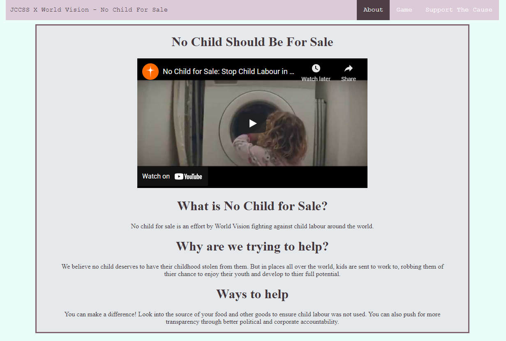
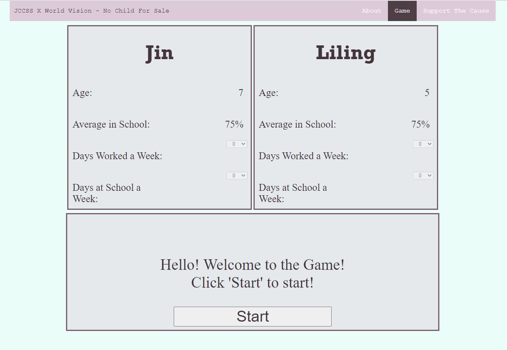

A website made as part of a winning entry into a competition at World Vision to highlight their No Child for Sale campaign.
The site is made with HTML and CSS, and includes a text-based game made in JavaScript.
The main page of the site has basic information about the effort, as well as a related video.
 
The game portion of the site highlights what the parent of two child workers may be feeling. You put yourself in her shoes, having to decide between the income your children provide, that you rely on, and sending them to school to be able to advance their careers in the future.
 
